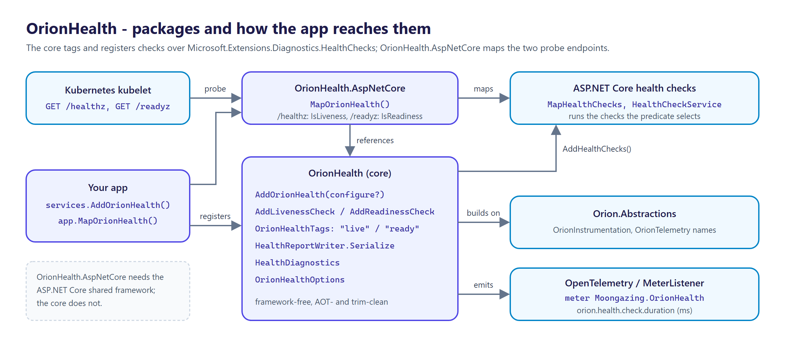

<p align="center">
  <picture>
    <source media="(prefers-color-scheme: dark)" srcset="docs/logo.png">
    
  </picture>
</p>

# OrionHealth

[](https://github.com/tunahanaliozturk/OrionHealth/actions/workflows/ci-cd.yml)
[](https://www.nuget.org/packages/OrionHealth/)
[](LICENSE)


**The suite's readiness story in one place.** An opinionated liveness/readiness split over `Microsoft.Extensions.Diagnostics.HealthChecks`: `/healthz` answers "is this process wedged — restart it?" (no dependency I/O) and `/readyz` answers "can this pod serve traffic right now?" (dependency probes) — so Kubernetes drains a pod whose database or Redis just died instead of crash-looping it on a transient blip.

Kubernetes needs two truthful signals, and conflating them is a production outage in either direction: a readiness probe wired to a liveness check *restarts* a pod on every downstream hiccup; a liveness probe that pings the database keeps a healthy-but-isolated pod alive while it can't work. `AspNetCore.Diagnostics.HealthChecks` is good plumbing but a blank framework — it doesn't ship the split, doesn't know your libraries, and doesn't tie health into your telemetry. OrionHealth ships the split as the default and emits health as the same OTel signal the rest of the suite uses.



## Packages

| Package | What it is |
|---------|------------|
| [`OrionHealth`](https://www.nuget.org/packages/OrionHealth/) | The framework-free core: `OrionHealthTags` (`live` / `ready`) and their predicates, `AddOrionHealth` with `AddLivenessCheck` / `AddReadinessCheck`, `HealthReportWriter` (structured JSON), `OrionHealthOptions` and `HealthDiagnostics` (OpenTelemetry). AOT-clean. |
| [`OrionHealth.AspNetCore`](https://www.nuget.org/packages/OrionHealth.AspNetCore/) | `MapOrionHealth()`, which maps `/healthz` + `/readyz`. References the ASP.NET Core shared framework and the core package. |

## Install

```bash
dotnet add package OrionHealth.AspNetCore   # brings in OrionHealth
```

Use `dotnet add package OrionHealth` alone when you only need the tags, the registration helpers and the JSON writer without ASP.NET Core.

## Usage

```csharp
using Microsoft.Extensions.Diagnostics.HealthChecks;
using Moongazing.OrionHealth.DependencyInjection;
using Moongazing.OrionHealth.AspNetCore;

builder.Services.AddOrionHealth()
    .AddLivenessCheck("self", () => HealthCheckResult.Healthy())          // process-only, gates /healthz
    .AddReadinessCheck("db", async ct => await PingDatabaseAsync(ct))     // dependency, gates /readyz
    .AddCheck("custom", () => HealthCheckResult.Healthy(), tags: ["ready"]); // plain checks compose

var app = builder.Build();
app.MapOrionHealth();   // maps /healthz (liveness) + /readyz (readiness)
```

`AddReadinessCheck` passes `CancellationToken.None` to the delegate in 0.1.0; the request's token is not forwarded yet.


- `/healthz` → **200** unless a liveness-tagged check reports `Unhealthy` (it runs only `live`-tagged checks, so no dependency I/O; with no liveness checks it always answers 200).
- `/readyz` → **200** when every readiness-tagged probe is `Healthy` or `Degraded`; **503** when any is `Unhealthy` or throws, with per-dependency detail:

```jsonc
{
  "status": "Unhealthy",
  "results": {
    "cache": { "status": "Healthy",   "durationMs": 3.12 },
    "db":    { "status": "Unhealthy", "durationMs": 2001.4, "description": "connection refused" }
  },
  "traceId": "a1b2..."
}
```

Each entry carries `status` and `durationMs`, plus `description` and `error` (the exception message) when they are set. Both endpoints write this JSON.

`AddOrionHealth` also takes an optional `Action<OrionHealthOptions>`: `ProbeTimeout` (default 2 s, must be positive) and `CacheDuration` (default 5 s, must not be negative). In 0.1.0 nothing reads them yet: they are validated only when your code resolves `IOptions<OrionHealthOptions>`, and enforced from a later wave (see the roadmap).

## Observability

A `Moongazing.OrionHealth` meter records `orion.health.check.duration` (a per-check histogram in milliseconds, tagged `orion.health.check` with the check name and `orion.health.status` with its status) every time `/healthz` or `/readyz` answers, so a dashboard shows the same up/down signal Kubernetes acts on. Both responses carry a `traceId` (the current `Activity` trace id, else `HttpContext.TraceIdentifier`) linking them to the request's trace.

## Roadmap

This is the **Wave 1** foundation (v0.1): the liveness/readiness split, tag routing, the structured JSON writer, and telemetry. Later waves add bounded + cached probes (every check runs under `ProbeTimeout`; concurrent probes share a result for `CacheDuration`, so health checks never hang the endpoint or become a load generator) via [OrionResilience](https://github.com/tunahanaliozturk/OrionResilience)/[OrionClock](https://github.com/tunahanaliozturk/OrionClock) and the first package probe bridges (W2); more bridges — [OrionCache](https://github.com/tunahanaliozturk/OrionCache), [OrionRelay](https://github.com/tunahanaliozturk/OrionRelay), [OrionFlag](https://github.com/tunahanaliozturk/OrionFlag) — and richer `/health` JSON (W3); and suite-wide `AddOrionHealthAll()` auto-discovery, an OTel up/down gauge, and a Kubernetes recipe (W4, GA). See [CHANGELOG.md](CHANGELOG.md).

OrionHealth composes with `IHealthCheck`, so any existing custom check keeps working. It is not a monitoring/alerting system (point Prometheus/Grafana at the endpoints), not a health *dashboard UI* (structured JSON only), and runs cheap reachability probes — no deep/expensive diagnostic checks on the readiness path.

## Versioning

Follows [Semantic Versioning](https://semver.org/). Multi-targets `net8.0`, `net9.0`, and `net10.0`. Binds to `Orion.Abstractions` 1.x; the core is AOT- and trim-clean (verified by a native-binary smoke test), while `OrionHealth.AspNetCore` references the ASP.NET Core shared framework.

## Documentation

- [CHANGELOG.md](CHANGELOG.md) — release notes.
- [SECURITY.md](SECURITY.md) — how to report a vulnerability privately.

## Contributing

Contributions are welcome. See [CONTRIBUTING.md](CONTRIBUTING.md) and the [CODE_OF_CONDUCT.md](CODE_OF_CONDUCT.md).

## More from the Orion family

Focused .NET libraries built to one quality bar. Each is usable on its own; several share the small [`Orion.Abstractions`](https://github.com/tunahanaliozturk/Orion.Abstractions) contracts spine, but there is no deep dependency web — pick only what you need:

- [Orion.Abstractions](https://github.com/tunahanaliozturk/Orion.Abstractions) — the shared contracts spine: telemetry, options, result, clock
- [OrionClock](https://github.com/tunahanaliozturk/OrionClock) — a `TimeProvider`-based clock with TTL / deadline vocabulary
- [OrionResult](https://github.com/tunahanaliozturk/OrionResult) — Result/Option types and a shared error vocabulary
- [OrionCache](https://github.com/tunahanaliozturk/OrionCache) — cache-aside with single-flight stampede protection
- [OrionResilience](https://github.com/tunahanaliozturk/OrionResilience) — retry, backoff, and timeout on OrionClock
- [OrionRate](https://github.com/tunahanaliozturk/OrionRate) — rate limiting on OrionClock
- [OrionFlag](https://github.com/tunahanaliozturk/OrionFlag) — in-process feature flags
- [OrionPage](https://github.com/tunahanaliozturk/OrionPage) — keyset/cursor pagination for EF Core
- [OrionEnvelope](https://github.com/tunahanaliozturk/OrionEnvelope) — one HTTP contract: envelope + problem+json
- [OrionGuard](https://github.com/tunahanaliozturk/OrionGuard) — validation, guard clauses, DDD primitives, domain events
- [OrionAudit](https://github.com/tunahanaliozturk/OrionAudit) — automatic EF Core change-audit trail
- [OrionBeacon](https://github.com/tunahanaliozturk/OrionBeacon) — leader election with fencing tokens
- [OrionGrant](https://github.com/tunahanaliozturk/OrionGrant) — permission / authorization checks
- [OrionInbox](https://github.com/tunahanaliozturk/OrionInbox) — transactional inbox for exactly-once effects
- [OrionKey](https://github.com/tunahanaliozturk/OrionKey) — source-generated strongly-typed IDs
- [OrionLedger](https://github.com/tunahanaliozturk/OrionLedger) — API-key issuance, verification, and rotation
- [OrionLens](https://github.com/tunahanaliozturk/OrionLens) — ambient correlation-context propagation
- [OrionLock](https://github.com/tunahanaliozturk/OrionLock) — distributed locks with fencing tokens
- [OrionOnce](https://github.com/tunahanaliozturk/OrionOnce) — idempotency keys for exactly-once request handling
- [OrionPatch](https://github.com/tunahanaliozturk/OrionPatch) — transactional outbox for EF Core
- [OrionRelay](https://github.com/tunahanaliozturk/OrionRelay) — outbound webhook delivery (HMAC, retries, backoff)
- [OrionSaga](https://github.com/tunahanaliozturk/OrionSaga) — sagas / process managers for long-running workflows
- [OrionShade](https://github.com/tunahanaliozturk/OrionShade) — sensitive-data redaction for logs and telemetry
- [OrionStream](https://github.com/tunahanaliozturk/OrionStream) — server-sent events / streaming hub
- [OrionVault](https://github.com/tunahanaliozturk/OrionVault) — field-level encryption for EF Core

See it all working together in [OrionShowcase](https://github.com/tunahanaliozturk/OrionShowcase), a production-shaped banking sample.

## License

[MIT](LICENSE).
